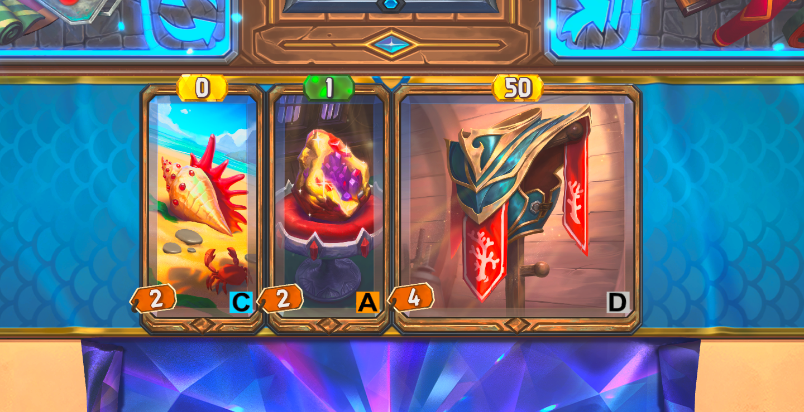

# BazaarRecommend

在 The Bazaar 游戏中，为每张物品卡牌右下角叠加显示来自 [Unduel BazaarDB 全物品 Tier List](https://unduel.com/u/bazaardb/all-items-in-the-bazaar-2p1gJ5h503y0TBHOLeR5RZ/tier-list) 的 Tier 评级徽章。



徽章颜色对应评级：

| 评级 | 颜色 |
|------|------|
| S    | 金色 |
| A    | 橙色 |
| B    | 绿色 |
| C    | 蓝色 |
| D    | 灰色 |
| F    | 白色 |

---

## 前提：安装 BazaarPlusPlus

本插件依赖 BepInEx 运行环境。推荐先安装 [BazaarPlusPlus](https://github.com/cauyxy/BazaarPlusPlus)，按照其说明完成安装后，游戏目录下会自动包含 BepInEx，无需额外配置。

---

## 方式一：直接下载 DLL（推荐）

1. 前往 [Releases](../../releases) 页面，下载最新的 `bazaar-recommend.dll`
2. 将 DLL 放入游戏的 BepInEx 插件目录：

   **Steam 版**
   ```
   C:\Program Files (x86)\Steam\steamapps\common\The Bazaar\BepInEx\plugins\
   ```

3. 启动游戏，进入对局后物品卡牌右下角即可看到 Tier 徽章。

---

## 方式二：本地编译

### 环境要求

- [.NET SDK 6+](https://dotnet.microsoft.com/download)
- Visual Studio 2022 或 Rider（可选）
- 已安装 [BazaarPlusPlus](https://github.com/cauyxy/BazaarPlusPlus)（自带 BepInEx）的 The Bazaar 游戏本体

### 步骤

1. 克隆仓库：
   ```bash
   git clone <repo-url>
   cd BazaarPlannerMod
   ```

2. 打开 `BazaarRecommend.csproj`，根据实际安装位置修改游戏路径：
   ```xml
   <SteamPath>D:\Program Files (x86)\Steam\steamapps\common\The Bazaar</SteamPath>
   ```

3. 编译（Release 模式）：
   ```bash
   dotnet build -c Release
   ```
   编译完成后 DLL 会自动复制到游戏的 `BepInEx\plugins\bazaar-recommend.dll`。

4. 启动游戏即可生效。

### 更新 Tier 数据

Tier 数据来源为 `Data/tierlist.json`（内嵌于 DLL），由 Unduel 的全物品 Tier List 提取，并用本地游戏缓存中的卡牌 GUID 对齐生成。若需更新评级，修改 json 文件后重新编译即可。

---

## 致谢

- [BazaarPlusPlus](https://github.com/cauyxy/BazaarPlusPlus) — BepInEx 环境及 Mod 框架支持
- [BazaarPlannerMod](https://github.com/oceanseth/BazaarPlannerMod) — 项目结构参考
